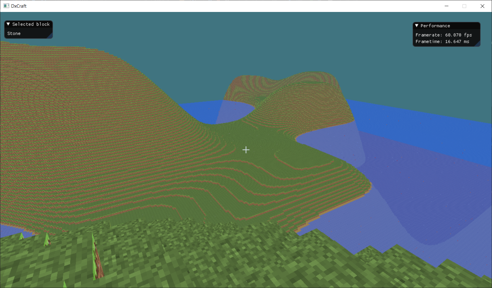

# DxCraft

DxCraft is a work in progress Minecraft clone made in C++17 and DirectX11
# To-do list
  - [x] Chunk meshing
  - [x] Block Texturing
  - [x] Block placing/destruction
  - [x] Collision
  - [x] Player physics
  - [X] Meshing non cube elements
  - [X] Frustum culling
  - [x] Metadata system
  - [x] Plants/trees
  - [ ] Water/lava (in progress)
  - [ ] Biomes (in progress)
  - [x] Dynamic world generation
  - [ ] Shading

# Thanks to
First of all, I have to thank [ChiliTomatoNoode](https://www.youtube.com/user/ChiliTomatoNoodle) and his [C++ 3D DirectX Programming](https://www.youtube.com/playlist?list=PLqCJpWy5Fohd3S7ICFXwUomYW0Wv67pDD) tutorials. A lot of my DirectX/Win32 knowledge came directly from him and I thank him a lot for making those tutorials.

Secondly, I thank a lot of people on Discord servers that helped me with stuff when I got stuck, specially since I had some issues that I would have still been stuck on if I havent had help from those people

# Third party libraries used

 - [FastNoise](https://github.com/Auburns/FastNoise)
 - [robin-hood-hashing](https://github.com/martinus/robin-hood-hashing)
 - [ImGui](https://github.com/ocornut/imgui)

# Legal note
Artwork in this game and Minecraft trademark are in sole ownership of Mojang AB and I do not share any association with the company

License 
-
This repository and it's contents are licensed under the MIT License.
